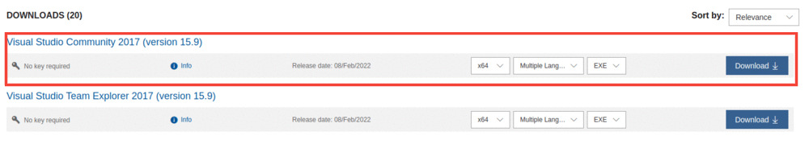

# PyTorch EfficientDet API


A simple training, testing, and inference pipeline using [Ross Wightman's EfficientDet models](https://github.com/rwightman/efficientdet-pytorch). Ross Wightman's repo is used a submodule to load the EfficientDet models. 

The training/testing/inference code are custom written.

Get started with training within 5 minutes if you have the images and XML annotation files.


## Get Started with Inference

​																													[](https://colab.research.google.com/drive/1-_g9yqE3DA4Q3r2Tw1jRG86SCshIAOx1?usp=sharing) [](https://www.kaggle.com/sovitrath/pytorch-efficientdet-api-coco-model-inference)


## Go To

* [Setup for Ubuntu](#Setup-for-Ubuntu)
* [Setup on Windows](#Setup-on-Windows)
* [Train on Custom Dataset](#Train-on-Custom-Dataset)
* [Inference](#Inference)


## Setup for Ubuntu

1. Clone the repository.

   ```
   git clone --recursive https://github.com/sovit-123/pytorch-efficientdet-api.git
   ```

2. Install requirements.

   1. **Method 1**: If you have CUDA and cuDNN set up already, do this in your environment of choice

      ```
      pip install -r requirments.txt
      ```

   2. **Method 2**: If you want to install PyTorch with CUDA Toolkit in your environment of choice.

      ```
      conda install pytorch torchvision torchaudio cudatoolkit=10.2 -c pytorch
      ```

      OR

      ```
      conda install pytorch torchvision torchaudio cudatoolkit=11.3 -c pytorch
      ```

      OR install the version with CUDA support as per your choice from **[here](https://pytorch.org/get-started/locally/)**.

      Then install the remaining **[requirements](https://github.com/sovit-123/pytorch-efficientdet-api/blob/main/requirements.txt)**.


## Setup on Windows

1. **First you need to install Microsoft Visual Studio from [here](https://my.visualstudio.com/Downloads?q=Visual%20Studio%202017)**. Sing In/Sing Up by clicking on **[this link](https://my.visualstudio.com/Downloads?q=Visual%20Studio%202017)** and download the **Visual Studio Community 2017** edition.

   

   Install with all the default chosen settings. It should be around 6 GB. Mainly, we need the C++ Build Tools.

2. Then install the proper **`pycocotools`** for Windows.

   ```
   pip install git+https://github.com/gautamchitnis/cocoapi.git@cocodataset-master#subdirectory=PythonAPI
   ```

3. Clone the repository.

   ```
   git clone --recursive https://github.com/sovit-123/pytorch-efficientdet-api.git
   ```

4. Install PyTorch with CUDA support.

   ```
   conda install pytorch torchvision torchaudio cudatoolkit=10.2 -c pytorch
   ```

   OR

   ```
   conda install pytorch torchvision torchaudio cudatoolkit=11.3 -c pytorch
   ```

   OR install the version with CUDA support as per your choice from **[here](https://pytorch.org/get-started/locally/)**.

   Then install the remaining **[requirements](https://github.com/sovit-123/pytorch-efficientdet-api/blob/main/requirements.txt)** except for `pycocotools`.


## Train on Custom Dataset

Taking an exmaple of the [smoke dataset](https://www.kaggle.com/didiruh/smoke-pascal-voc) from Kaggle. Let's say that the dataset is in the `data/smoke_pascal_voc` directory in the following format. And the `smoke.yaml` is in the `data_configs` directory.

```
├── data
│   ├── smoke_pascal_voc
│   │   ├── archive
│   │   │   ├── train
│   │   │   └── valid
│   └── README.md
├── data_configs
│   └── smoke.yaml
├── efficientdet-pytorch
│   ├── effdet
│   ...
├── model_configs
│   └── model_config.yaml
├── models
│   ├── efficientdet_d0.py
│   ├── efficientdet_model.py
│   └── tf_efficientdet_lite0.py
├── outputs
│   ├── inference
│   │   ├── res_1
│   │   └── res_2
│   └── training
│       ├── res_1
│       └── res_2
├── torch_utils
│   ├── coco_eval.py
│   ├── coco_utils.py
│   ├── engine.py
│   ├── README.md
│   └── utils.py
├── config.py
├── custom_utils.py
├── datasets.py
├── README.md
├── requirements.txt
├── test_image.py
├── test_video.py
└── train.py
```

The content of the `smoke.yaml` should be the following:

```yaml
# TRAIN_DIR should be relative to train.py
TRAIN_DIR_IMAGES: data/smoke_pascal_voc/archive/train/images
TRAIN_DIR_LABELS: data/smoke_pascal_voc/archive/train/annotations
# VALID_DIR should be relative to train.py
VALID_DIR_IMAGES: data/smoke_pascal_voc/archive/valid/images
VALID_DIR_LABELS: data/smoke_pascal_voc/archive/valid/annotations
# Class names.
CLASSES: ['smoke']
# Number of classes.
NC: 1
# Whether to save the predictions of the validation set while training.
SAVE_VALID_PREDICTION_IMAGES: True
```

***Note that*** *the data and annotations can be in the same directory as well. In that case, the TRAIN_DIR_IMAGES and TRAIN_DIR_LABELS will save the same path. Similarly for VALID images and labels. The `datasets.py` will take care of that*.

Next, to start the training, you can use the following command.

**Command format:**

```
python train.py --model <name of the model (default tf_efficientdet_lite0)> --config <path to the data config> --device <computation device (default cuda:0 if GPU available system)> --epochs <epochs to train for> --workers <number of parallel workers (default 4)> --batch-size <batch size for data loading (default 8)>  
```

**In this case, the exact command would be:**

```
python train.py --model tf_efficientdet_lite0 --config data_configs/smoke.yaml --device cuda:0 --epochs 5 --workers 4 --batch-size 8  
```

**The terimal output should be similar to the following:**

```
Number of training samples: 665
Number of validation samples: 72

3,191,405 total parameters.
3,191,405 training parameters.
Epoch     0: adjusting learning rate of group 0 to 1.0000e-03.
Epoch: [0]  [ 0/84]  eta: 0:02:17  lr: 0.000013  loss: 1.6518 (1.6518)  time: 1.6422  data: 0.2176  max mem: 1525
Epoch: [0]  [83/84]  eta: 0:00:00  lr: 0.001000  loss: 1.6540 (1.8020)  time: 0.0769  data: 0.0077  max mem: 1548
Epoch: [0] Total time: 0:00:08 (0.0984 s / it)
creating index...
index created!
Test:  [0/9]  eta: 0:00:02  model_time: 0.0928 (0.0928)  evaluator_time: 0.0245 (0.0245)  time: 0.2972  data: 0.1534  max mem: 1548
Test:  [8/9]  eta: 0:00:00  model_time: 0.0318 (0.0933)  evaluator_time: 0.0237 (0.0238)  time: 0.1652  data: 0.0239  max mem: 1548
Test: Total time: 0:00:01 (0.1691 s / it)
Averaged stats: model_time: 0.0318 (0.0933)  evaluator_time: 0.0237 (0.0238)
Accumulating evaluation results...
DONE (t=0.03s).
IoU metric: bbox
 Average Precision  (AP) @[ IoU=0.50:0.95 | area=   all | maxDets=100 ] = 0.001
 Average Precision  (AP) @[ IoU=0.50      | area=   all | maxDets=100 ] = 0.002
 Average Precision  (AP) @[ IoU=0.75      | area=   all | maxDets=100 ] = 0.000
 Average Precision  (AP) @[ IoU=0.50:0.95 | area= small | maxDets=100 ] = 0.000
 Average Precision  (AP) @[ IoU=0.50:0.95 | area=medium | maxDets=100 ] = 0.001
 Average Precision  (AP) @[ IoU=0.50:0.95 | area= large | maxDets=100 ] = 0.009
 Average Recall     (AR) @[ IoU=0.50:0.95 | area=   all | maxDets=  1 ] = 0.007
 Average Recall     (AR) @[ IoU=0.50:0.95 | area=   all | maxDets= 10 ] = 0.029
 Average Recall     (AR) @[ IoU=0.50:0.95 | area=   all | maxDets=100 ] = 0.074
 Average Recall     (AR) @[ IoU=0.50:0.95 | area= small | maxDets=100 ] = 0.028
 Average Recall     (AR) @[ IoU=0.50:0.95 | area=medium | maxDets=100 ] = 0.088
 Average Recall     (AR) @[ IoU=0.50:0.95 | area= large | maxDets=100 ] = 0.167
SAVING PLOTS COMPLETE...
...
Epoch: [4]  [ 0/84]  eta: 0:00:20  lr: 0.001000  loss: 0.9575 (0.9575)  time: 0.2461  data: 0.1662  max mem: 1548
Epoch: [4]  [83/84]  eta: 0:00:00  lr: 0.001000  loss: 1.1325 (1.1624)  time: 0.0762  data: 0.0078  max mem: 1548
Epoch: [4] Total time: 0:00:06 (0.0801 s / it)
creating index...
index created!
Test:  [0/9]  eta: 0:00:02  model_time: 0.0369 (0.0369)  evaluator_time: 0.0237 (0.0237)  time: 0.2494  data: 0.1581  max mem: 1548
Test:  [8/9]  eta: 0:00:00  model_time: 0.0323 (0.0330)  evaluator_time: 0.0226 (0.0227)  time: 0.1076  data: 0.0271  max mem: 1548
Test: Total time: 0:00:01 (0.1116 s / it)
Averaged stats: model_time: 0.0323 (0.0330)  evaluator_time: 0.0226 (0.0227)
Accumulating evaluation results...
DONE (t=0.03s).
IoU metric: bbox
 Average Precision  (AP) @[ IoU=0.50:0.95 | area=   all | maxDets=100 ] = 0.137
 Average Precision  (AP) @[ IoU=0.50      | area=   all | maxDets=100 ] = 0.313
 Average Precision  (AP) @[ IoU=0.75      | area=   all | maxDets=100 ] = 0.118
 Average Precision  (AP) @[ IoU=0.50:0.95 | area= small | maxDets=100 ] = 0.029
 Average Precision  (AP) @[ IoU=0.50:0.95 | area=medium | maxDets=100 ] = 0.175
 Average Precision  (AP) @[ IoU=0.50:0.95 | area= large | maxDets=100 ] = 0.428
 Average Recall     (AR) @[ IoU=0.50:0.95 | area=   all | maxDets=  1 ] = 0.204
 Average Recall     (AR) @[ IoU=0.50:0.95 | area=   all | maxDets= 10 ] = 0.306
 Average Recall     (AR) @[ IoU=0.50:0.95 | area=   all | maxDets=100 ] = 0.347
 Average Recall     (AR) @[ IoU=0.50:0.95 | area= small | maxDets=100 ] = 0.140
 Average Recall     (AR) @[ IoU=0.50:0.95 | area=medium | maxDets=100 ] = 0.424
 Average Recall     (AR) @[ IoU=0.50:0.95 | area= large | maxDets=100 ] = 0.683
SAVING PLOTS COMPLETE...
```


## Inference

### Inference on Images using Pretrained Models

Use the **[efficientdet-pytorch](https://github.com/rwightman/efficientdet-pytorch)** models trained on the COCO dataset.

**Command format:**

```
python test_image.py --input <path/to/input/image> --model <model_name>
```

**Example:**

```
python test_image.py --input data/inference_data/image_1.jpg --model tf_efficientdet_lite0
```

### Inference on Images using Custom Trained Model

Use your custom trained model to run inference on any image. Providing path to config file is mandatory here to get class information

**Command format:**

```
python test_image.py --input <path/to/input/image> --model <model_name> --weights <path/to/saved_model_weights> --config <path/to/config file>
```

**Example:**

```
python test_image.py --input data/inference_data/image_1.jpg --model tf_efficientdet_lite0 --weights outputs/training/res_19/last_model_state.pth --config data_configs/smoke.yaml
```

### Inference on Videos using Pretrained Models

**Command format:**

```
python test_video.py --input <path/to/input/video> --model <model_name>
```

**Example:**

```
python test_video.py --input data/inference_data/video_2.mp4 --model tf_efficientdet_lite0
```

### Inference on Videos using Custom Trained Models

**Command format:**

```
python test_video.py --input <path/to/input/video> --model <model_name> --weights <path/to/saved_model_weights> --config <path/to/config file>
```

**Example:**

```
python test_video.py --input data/inference_data/video_3.mp4 --model tf_efficientdet_lite0 --weights outputs/training/res_19/last_model_state.pth --config data_configs/smoke.yaml
```

### 
